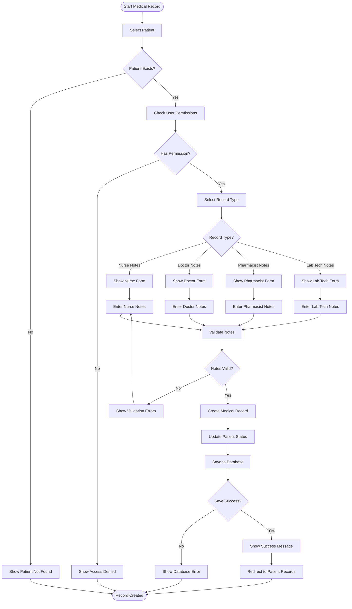

# Activity Diagram - Hospital Management System

## 1. User Login and Authentication Workflow

## 2. Patient Registration Workflow

## 3. Medical Record Creation Workflow

## 4. Pharmacy Drug Management Workflow

## 5. Payment Processing Workflow

## 6. Hospital Registration Workflow

## Key Workflow Characteristics:

1. **Role-Based Access Control**: Each workflow checks user permissions before proceeding
2. **Multi-Step Validation**: Data validation at multiple levels (frontend, API, database)
3. **Error Handling**: Comprehensive error handling with user-friendly messages
4. **Status Tracking**: All operations maintain proper status tracking
5. **Audit Trail**: All actions are logged for compliance and debugging
6. **Hospital Isolation**: All workflows respect hospital-based data isolation
7. **Real-time Updates**: Frontend components update based on workflow completion
8. **Queue Integration**: Long-running operations use background queues 