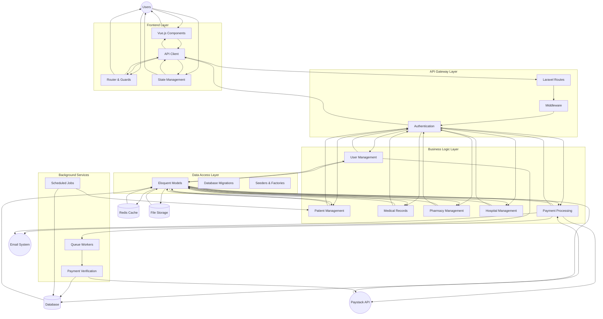
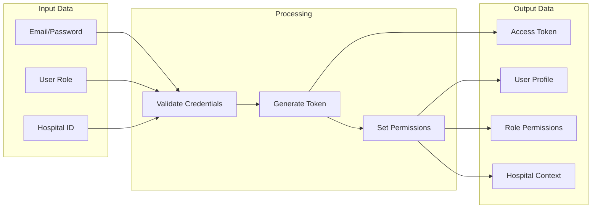
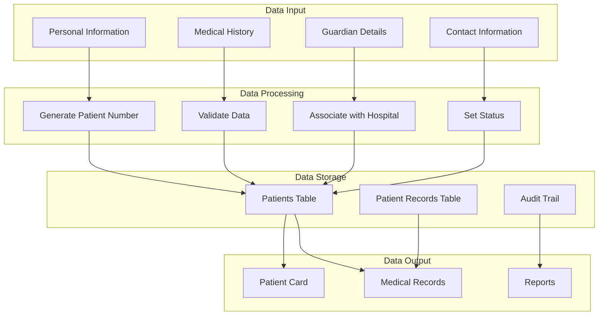
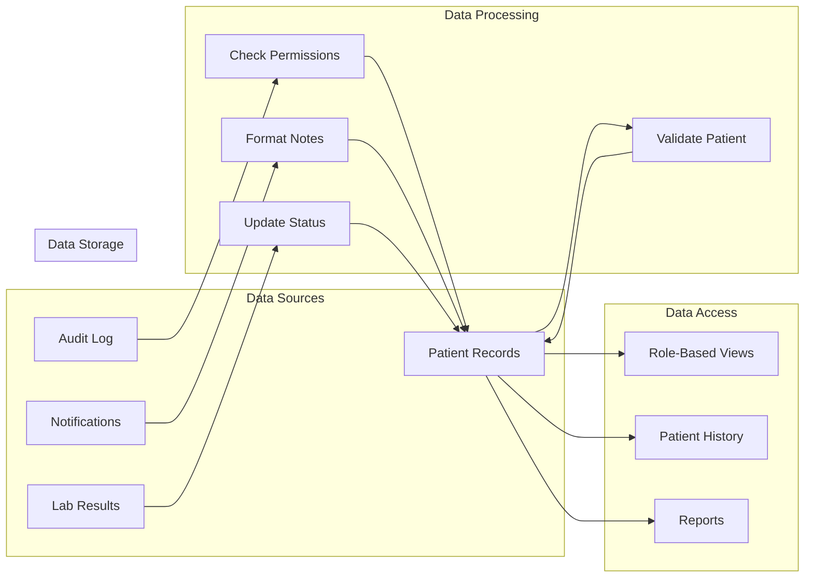
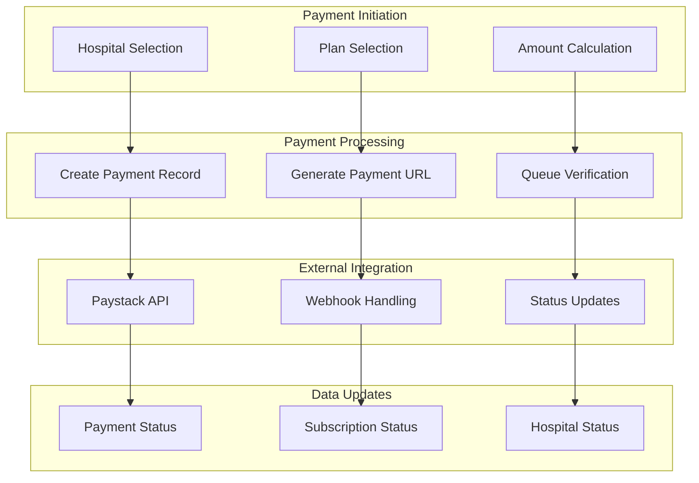

# Data Flow Diagram - Hospital Management System

## Main System Data Flow

## Detailed Data Flow by Module

### 1. User Authentication Data Flow

### 2. Patient Data Flow

### 3. Medical Records Data Flow

### 4. Payment Data Flow

## Key Data Characteristics:

1. **Multi-Tenant Data Isolation**: All data is scoped by hospital_id
2. **Role-Based Data Access**: Different user roles see different data subsets
3. **Real-time Data Updates**: Frontend components reactively update based on API responses
4. **Audit Trail**: All data changes are logged with timestamps and user information
5. **Data Validation**: Multiple layers of validation (frontend, API, database)
6. **Caching Strategy**: Redis cache for frequently accessed data
7. **Background Processing**: Queue system for data-intensive operations
8. **External Integrations**: Payment processing and email notifications 