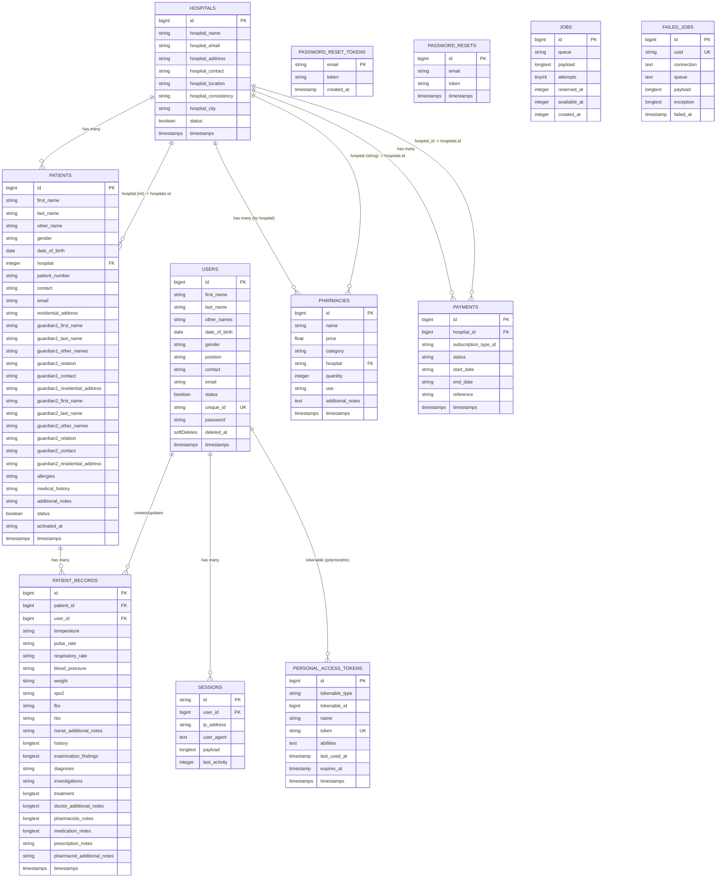

# Entity Relationship Diagram

```mermaid
erDiagram
  HOSPITALS {
    bigint id PK
    string hospital_name
    string hospital_email
    string hospital_address
    string hospital_contact
    string hospital_location
    string hospital_consistency
    string hospital_city
    boolean status
    timestamps timestamps
  }

  USERS {
    bigint id PK
    string first_name
    string last_name
    string other_names
    date date_of_birth
    string gender
    string position
    string contact
    string email
    boolean status
    string unique_id UK
    string password
    softDeletes deleted_at
    timestamps timestamps
  }

  PATIENTS {
    bigint id PK
    string first_name
    string last_name
    string other_name
    string gender
    date date_of_birth
    integer hospital FK
    string patient_number
    string contact
    string email
    string residential_address
    string guardian1_first_name
    string guardian1_last_name
    string guardian1_other_names
    string guardian1_relation
    string guardian1_contact
    string guardian1_residential_address
    string guardian2_first_name
    string guardian2_last_name
    string guardian2_other_names
    string guardian2_relation
    string guardian2_contact
    string guardian2_residential_address
    string allergies
    string medical_history
    string additional_notes
    boolean status
    string activated_at
    timestamps timestamps
  }

  PATIENT_RECORDS {
    bigint id PK
    bigint patient_id FK
    bigint user_id FK
    string temperature
    string pulse_rate
    string respiratory_rate
    string blood_pressure
    string weight
    string spo2
    string fbs
    string rbs
    string nurse_additional_notes
    longtext history
    longtext examination_findings
    string diagnosis
    string investigations
    longtext treatment
    longtext doctor_additional_notes
    longtext pharmacists_notes
    longtext medication_notes
    string prescription_notes
    string pharmacist_additional_notes
    timestamps timestamps
  }

  PHARMACIES {
    bigint id PK
    string name
    float price
    string category
    string hospital FK
    integer quantity
    string use
    text additional_notes
    timestamps timestamps
  }

  PAYMENTS {
    bigint id PK
    bigint hospital_id FK
    string subscription_type_id
    string status
    string start_date
    string end_date
    string reference
    timestamps timestamps
  }

  PASSWORD_RESET_TOKENS {
    string email PK
    string token
    timestamp created_at
  }

  PASSWORD_RESETS {
    bigint id PK
    string email
    string token
    timestamps timestamps
  }

  SESSIONS {
    string id PK
    bigint user_id FK
    string ip_address
    text user_agent
    longtext payload
    integer last_activity
  }

  PERSONAL_ACCESS_TOKENS {
    bigint id PK
    string tokenable_type
    bigint tokenable_id
    string name
    string token UK
    text abilities
    timestamp last_used_at
    timestamp expires_at
    timestamps timestamps
  }

  JOBS {
    bigint id PK
    string queue
    longtext payload
    tinyint attempts
    integer reserved_at
    integer available_at
    integer created_at
  }

  FAILED_JOBS {
    bigint id PK
    string uuid UK
    text connection
    text queue
    longtext payload
    longtext exception
    timestamp failed_at
  }

  %% Relationships (based on migrations; some implied where FKs are not explicit)
  HOSPITALS ||--o{ PATIENTS : "has many"
  HOSPITALS ||--o{ PAYMENTS : "has many"
  HOSPITALS ||--o{ PHARMACIES : "has many (by hospital)"

  PATIENTS ||--o{ PATIENT_RECORDS : "has many"
  USERS ||--o{ PATIENT_RECORDS : "creates/updates"

  USERS ||--o{ SESSIONS : "has many"

  USERS ||--o{ PERSONAL_ACCESS_TOKENS : "tokenable (polymorphic)"

  %% Notes on weak/implicit keys
  PATIENTS }o--|| HOSPITALS : "hospital (int) -> hospitals.id"
  PHARMACIES }o--|| HOSPITALS : "hospital (string) -> hospitals.id"
  PAYMENTS }o--|| HOSPITALS : "hospital_id -> hospitals.id"
```
