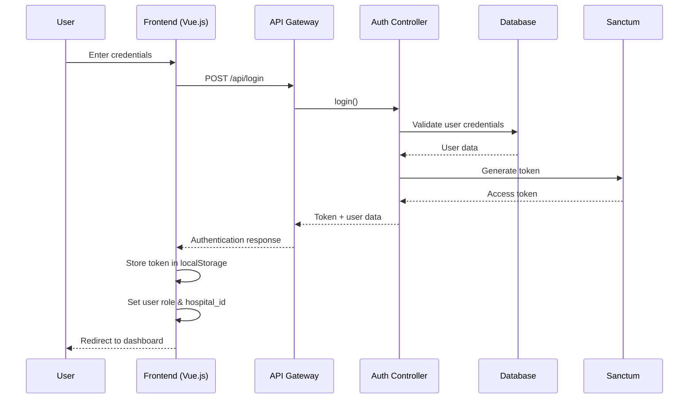
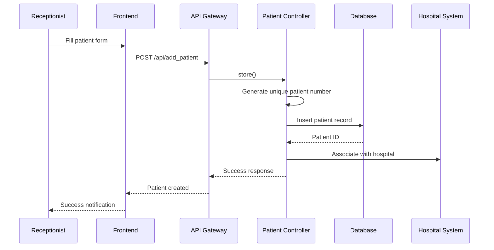
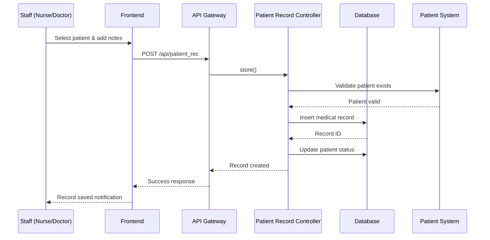
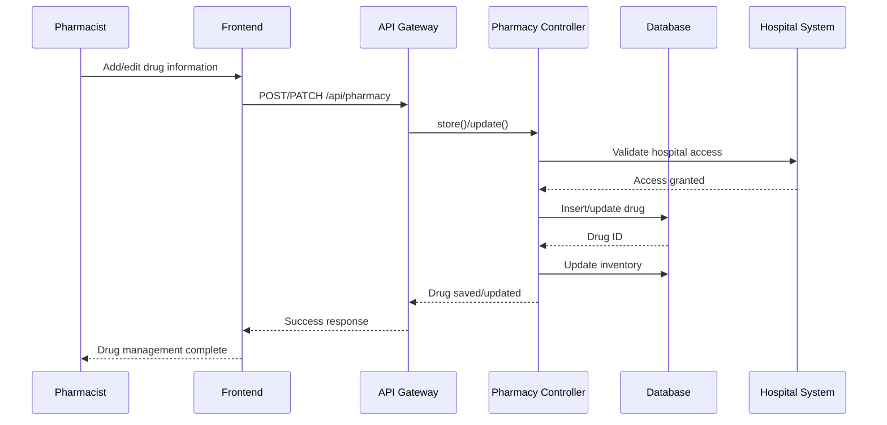
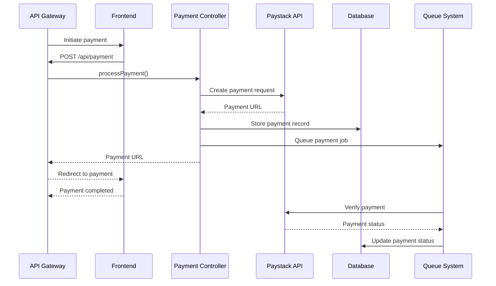
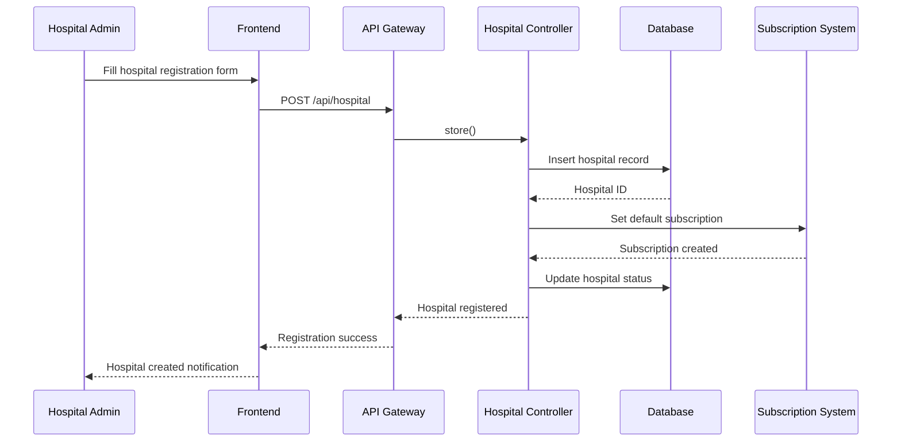

# Sequence Diagram - Hospital Management System

## 1. User Authentication Flow

## 2. Patient Registration Flow

## 3. Medical Record Creation Flow

## 4. Pharmacy Drug Management Flow

## 5. Payment Processing Flow

## 6. Hospital Registration Flow

## Key System Interactions:

1. **Authentication & Authorization**: Laravel Sanctum handles token-based authentication
2. **Role-Based Access Control**: Frontend validates user roles before API calls
3. **Multi-Tenant Architecture**: All operations are scoped to user's hospital
4. **Queue System**: Background jobs handle payment verification and patient deactivation
5. **API-First Design**: All frontend operations go through RESTful API endpoints
6. **Data Validation**: Both frontend and backend validate data integrity
7. **Real-time Updates**: Frontend components reactively update based on API responses 