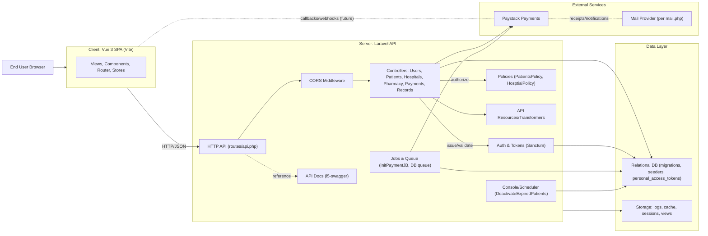

# System Architecture Diagram

```mermaid
flowchart LR
  Browser["End User Browser"]

  subgraph Client["Client: Vue 3 SPA (Vite)"]
    UI["Views, Components, Router, Stores"]
  end

  subgraph Server["Server: Laravel API"]
    API["HTTP API (routes/api.php)"]
    MW["CORS Middleware"]
    CTRLS["Controllers: Users, Patients, Hospitals, Pharmacy, Payments, Records"]
    AUTH["Auth & Tokens (Sanctum)"]
    POL["Policies (PatientsPolicy, HosptialPolicy)"]
    RES["API Resources/Transformers"]
    JOBS["Jobs & Queue (InitPaymentJB, DB queue)"]
    CON["Console/Scheduler (DeactivateExpiredPatients)"]
    SWAG["API Docs (l5-swagger)"]
  end

  subgraph Data["Data Layer"]
    DB["Relational DB (migrations, seeders, personal_access_tokens)"]
    STOR["Storage: logs, cache, sessions, views"]
  end

  subgraph External["External Services"]
    PAY["Paystack Payments"]
    MAIL["Mail Provider (per mail.php)"]
  end

  Browser --> Client
  Client -->|"HTTP/JSON"| API

  API --> MW
  MW --> CTRLS

  CTRLS -->|"authorize"| POL
  CTRLS -->|"issue/validate"| AUTH
  CTRLS --> RES
  CTRLS --> DB
  CTRLS --> PAY

  AUTH --> DB

  JOBS --> PAY
  JOBS --> DB

  CON --> DB

  Server --> STOR

  API -. reference .-> SWAG

  PAY -. callbacks/webhooks (future) .- Client
  PAY -. receipts/notifications .- MAIL
```