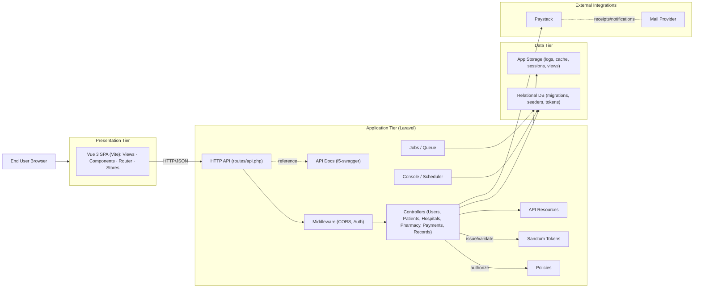

# System Architecture Diagram

```mermaid
flowchart LR
  %% Three-tier architecture: Presentation → Application → Data

  Browser["End User Browser"]

  subgraph Presentation["Presentation Tier"]
    Client["Vue 3 SPA (Vite): Views · Components · Router · Stores"]
  end

  subgraph Application["Application Tier (Laravel)"]
    API["HTTP API (routes/api.php)"]
    MW["Middleware (CORS, Auth)"]
    CTRLS["Controllers (Users, Patients, Hospitals, Pharmacy, Payments, Records)"]
    AUTH["Sanctum Tokens"]
    POL["Policies"]
    RES["API Resources"]
    JOBS["Jobs / Queue"]
    CON["Console / Scheduler"]
    SWAG["API Docs (l5-swagger)"]
  end

  subgraph Data["Data Tier"]
    DB["Relational DB (migrations, seeders, tokens)"]
    STOR["App Storage (logs, cache, sessions, views)"]
  end

  subgraph External["External Integrations"]
    PAY["Paystack"]
    MAIL["Mail Provider"]
  end

  %% Flows across tiers
  Browser --> Presentation
  Client -->|"HTTP/JSON"| API
  API --> MW --> CTRLS
  CTRLS -->|"authorize"| POL
  CTRLS -->|"issue/validate"| AUTH
  CTRLS --> RES
  CTRLS --> DB
  Application --> STOR
  JOBS --> DB
  CON --> DB

  %% External interactions
  CTRLS --> PAY
  PAY -. receipts/notifications .- MAIL
  API -. reference .-> SWAG
```