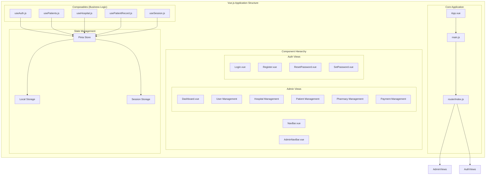
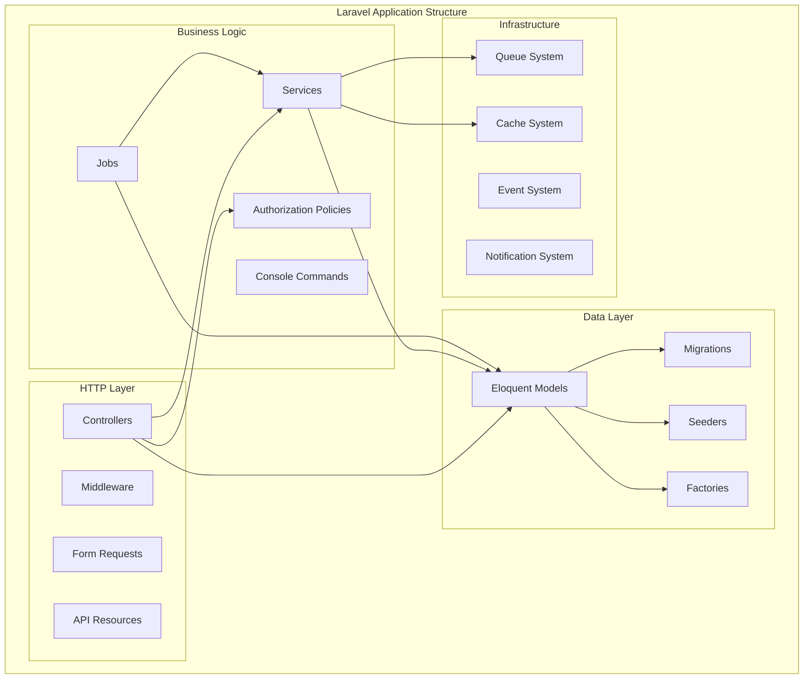
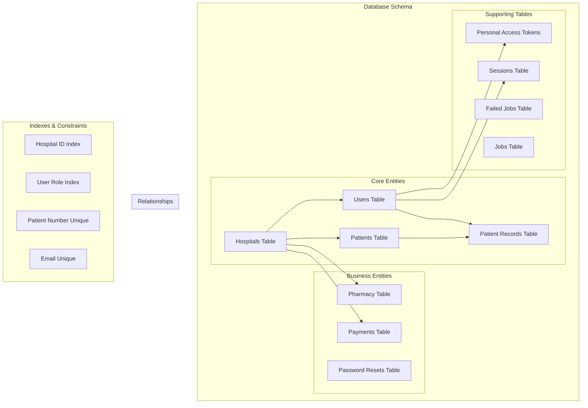
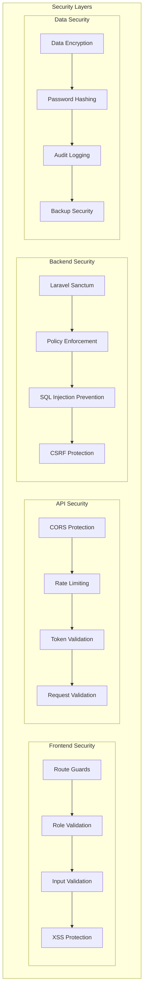

# System Architecture Diagram - Hospital Management System

## High-Level System Architecture

```mermaid
graph TB
    %% External Users
    subgraph "External Users"
        Admin((Admin Users))
        Staff((Hospital Staff))
        Patients((Patients))
    end
    
    %% Frontend Layer
    subgraph "Frontend Layer (Vue.js 3)"
        subgraph "Core Components"
            Router[Vue Router]
            Store[Pinia Store]
            Auth[Authentication]
            Guards[Route Guards]
        end
        
        subgraph "Feature Modules"
            UserMgmt[User Management]
            PatientMgmt[Patient Management]
            MedicalRec[Medical Records]
            Pharmacy[Pharmacy Management]
            HospitalMgmt[Hospital Management]
            Payment[Payment System]
        end
        
        subgraph "UI Framework"
            Bootstrap[Bootstrap 5]
            PrimeVue[PrimeVue Components]
            Icons[Bootstrap Icons]
        end
    end
    
    %% API Gateway Layer
    subgraph "API Gateway Layer"
        subgraph "Laravel Routes"
            WebRoutes[Web Routes]
            APIRoutes[API Routes]
            ConsoleRoutes[Console Routes]
        end
        
        subgraph "Middleware Stack"
            CORS[CORS Middleware]
            Auth[Authentication]
            RoleCheck[Role Validation]
            HospitalScope[Hospital Scoping]
        end
    end
    
    %% Business Logic Layer
    subgraph "Business Logic Layer (Laravel Controllers)"
        UserController[User Controller]
        PatientController[Patient Controller]
        RecordController[Patient Record Controller]
        PharmacyController[Pharmacy Controller]
        HospitalController[Hospital Controller]
        PaymentController[Payment Controller]
    end
    
    %% Service Layer
    subgraph "Service Layer"
        AuthService[Authentication Service]
        PatientService[Patient Service]
        PharmacyService[Pharmacy Service]
        PaymentService[Payment Service]
        NotificationService[Notification Service]
    end
    
    %% Data Access Layer
    subgraph "Data Access Layer"
        subgraph "Eloquent Models"
            UserModel[User Model]
            PatientModel[Patient Model]
            RecordModel[Patient Record Model]
            PharmacyModel[Pharmacy Model]
            HospitalModel[Hospital Model]
            PaymentModel[Payment Model]
        end
        
        subgraph "Database"
            MySQL[(MySQL Database)]
            Migrations[Database Migrations]
            Seeders[Database Seeders]
            Factories[Model Factories]
        end
    end
    
    %% External Services
    subgraph "External Services"
        Paystack[Paystack Payment API]
        Email[Email Service]
        Queue[Redis Queue System]
    end
    
    %% Background Services
    subgraph "Background Services"
        QueueWorkers[Queue Workers]
        ScheduledJobs[Scheduled Jobs]
        PaymentVerification[Payment Verification]
        PatientDeactivation[Patient Deactivation]
    end
    
    %% Infrastructure
    subgraph "Infrastructure"
        WebServer[Web Server (Apache/Nginx)]
        PHP[PHP 8.2+]
        Node[Node.js (Vite)]
        Redis[Redis Cache]
        Storage[File Storage]
    end

    %% Data Flow Connections
    Admin --> Router
    Staff --> Router
    Patients --> Router
    
    Router --> Store
    Router --> Auth
    Router --> Guards
    
    Store --> UserMgmt
    Store --> PatientMgmt
    Store --> MedicalRec
    Store --> Pharmacy
    Store --> HospitalMgmt
    Store --> Payment
    
    UserMgmt --> APIRoutes
    PatientMgmt --> APIRoutes
    MedicalRec --> APIRoutes
    Pharmacy --> APIRoutes
    HospitalMgmt --> APIRoutes
    Payment --> APIRoutes
    
    APIRoutes --> CORS
    CORS --> Auth
    Auth --> RoleCheck
    RoleCheck --> HospitalScope
    
    HospitalScope --> UserController
    HospitalScope --> PatientController
    HospitalScope --> RecordController
    HospitalScope --> PharmacyController
    HospitalScope --> HospitalController
    HospitalScope --> PaymentController
    
    UserController --> AuthService
    PatientController --> PatientService
    PharmacyController --> PharmacyService
    PaymentController --> PaymentService
    
    AuthService --> UserModel
    PatientService --> PatientModel
    RecordController --> RecordModel
    PharmacyService --> PharmacyModel
    HospitalController --> HospitalModel
    PaymentService --> PaymentModel
    
    UserModel --> MySQL
    PatientModel --> MySQL
    RecordModel --> MySQL
    PharmacyModel --> MySQL
    HospitalModel --> MySQL
    PaymentModel --> MySQL
    
    PaymentService --> Paystack
    NotificationService --> Email
    
    PaymentController --> Queue
    Queue --> QueueWorkers
    QueueWorkers --> PaymentVerification
    QueueWorkers --> PatientDeactivation
    
    WebServer --> PHP
    PHP --> Laravel
    Node --> Vite
    Vite --> Frontend
    
    %% Styling
    classDef external fill:#ffebee,stroke:#c62828,stroke-width:2px
    classDef frontend fill:#e3f2fd,stroke:#1565c0,stroke-width:2px
    classDef api fill:#f3e5f5,stroke:#7b1fa2,stroke-width:2px
    classDef business fill:#e8f5e8,stroke:#2e7d32,stroke-width:2px
    classDef data fill:#fff3e0,stroke:#ef6c00,stroke-width:2px
    classDef externalService fill:#fce4ec,stroke:#ad1457,stroke-width:2px
    classDef infrastructure fill:#f1f8e9,stroke:#558b2f,stroke-width:2px

    class Admin,Staff,Patients external
    class Router,Store,Auth,Guards,UserMgmt,PatientMgmt,MedicalRec,Pharmacy,HospitalMgmt,Payment,Bootstrap,PrimeVue,Icons frontend
    class WebRoutes,APIRoutes,ConsoleRoutes,CORS,Auth,RoleCheck,HospitalScope api
    class UserController,PatientController,RecordController,PharmacyController,HospitalController,PaymentController,AuthService,PatientService,PharmacyService,PaymentService,NotificationService business
    class UserModel,PatientModel,RecordModel,PharmacyModel,HospitalModel,PaymentModel,MySQL,Migrations,Seeders,Factories data
    class Paystack,Email,Queue,QueueWorkers,ScheduledJobs,PaymentVerification,PatientDeactivation externalService
    class WebServer,PHP,Node,Redis,Storage infrastructure
```

## Detailed Component Architecture

### 1. Frontend Architecture



### 2. Backend Architecture



### 3. Database Architecture



### 4. Security Architecture



## System Characteristics:

### **Architecture Patterns:**
1. **Layered Architecture**: Clear separation between presentation, business logic, and data layers
2. **MVC Pattern**: Model-View-Controller separation in both frontend and backend
3. **Repository Pattern**: Data access abstraction through Eloquent models
4. **Service Layer**: Business logic encapsulation in service classes
5. **Middleware Pattern**: Cross-cutting concerns handled through middleware

### **Technology Stack:**
- **Frontend**: Vue.js 3, Vite, Bootstrap 5, PrimeVue
- **Backend**: Laravel 11, PHP 8.2+, MySQL
- **Authentication**: Laravel Sanctum
- **Caching**: Redis
- **Queue System**: Laravel Queue with Redis
- **Payment**: Paystack API integration

### **Scalability Features:**
1. **Multi-Tenant Architecture**: Hospital-based data isolation
2. **Queue System**: Background job processing
3. **Caching Strategy**: Redis for performance optimization
4. **API-First Design**: RESTful API for frontend-backend communication
5. **Modular Frontend**: Component-based architecture for maintainability

### **Security Features:**
1. **Role-Based Access Control**: Granular permissions per user role
2. **Token-Based Authentication**: Secure API access
3. **Data Validation**: Multiple layers of input validation
4. **Audit Logging**: Complete action tracking
5. **Hospital Isolation**: Data segregation between hospitals 